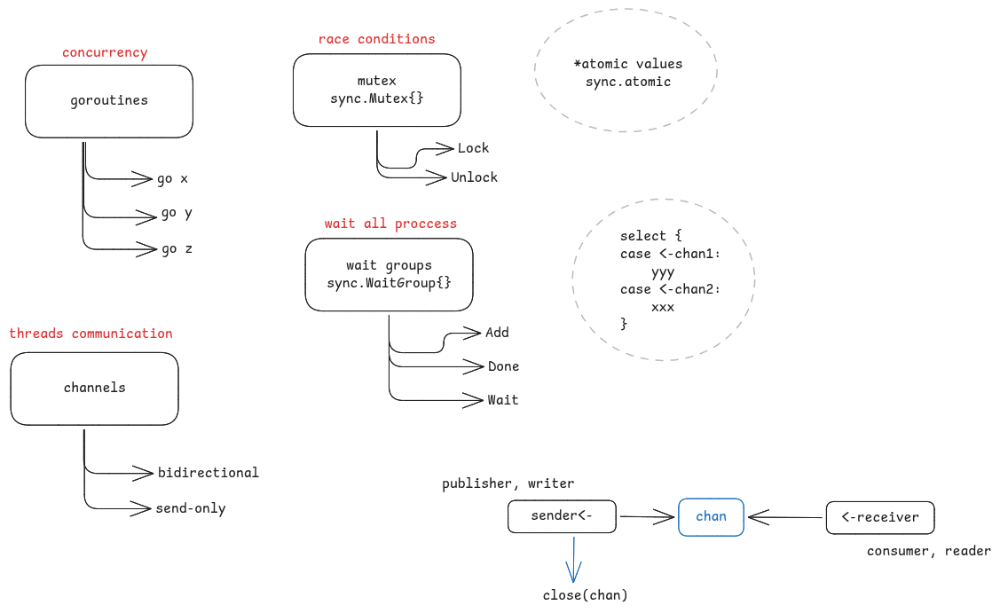

# 🚀 Desafio: Multithreading + APIs

Neste desafio você deverá aplicar os conceitos de **Multithreading** e **consumo de APIs** para buscar o resultado mais rápido entre duas APIs distintas.

---

## 🔹 APIs a serem consultadas

As duas requisições deverão ser feitas **simultaneamente** para as seguintes URLs:

- [Brasil API](https://brasilapi.com.br/api/cep/v1/01153000) → `https://brasilapi.com.br/api/cep/v1/{cep}`
- [ViaCEP](http://viacep.com.br/) → `http://viacep.com.br/ws/{cep}/json/`

---

## 🔹 Requisitos

- ✅ Realizar chamadas para as duas APIs em **paralelo** (multithreading).  
- ✅ Considerar **somente a resposta mais rápida** e descartar a mais lenta.  
- ✅ Exibir no **command line**:
  - Os dados do endereço retornados.
  - Qual API enviou a resposta.  
- ✅ Definir **timeout de 1 segundo**:
  - Caso ambas as APIs ultrapassem esse limite, exibir mensagem de erro.

## 🔹 Rodando aplicação web

- Para baixar as dependências `go mod tidy`
- Para rodar `go run main.go`
- A aplicação usa *go-chi* com um endpoint único `http://localhost:3000/search/{cep}`

 

