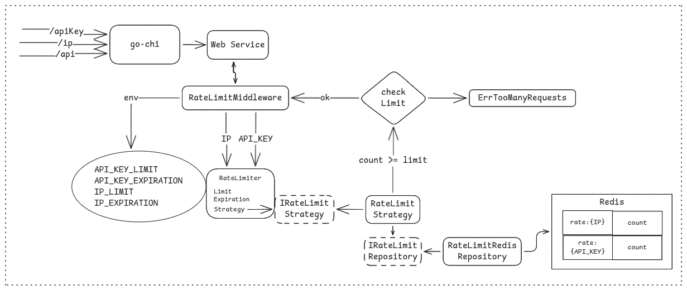

### Objetivo
Desenvolver um rate limiter em Go que possa ser configurado para limitar o número máximo de requisições por segundo com base em um endereço IP específico ou em um token de acesso.

### Descrição
O objetivo deste desafio é criar um rate limiter em Go que possa ser utilizado para controlar o tráfego de requisições para um serviço web. O rate limiter deve ser capaz de limitar o número de requisições com base em dois critérios:

1. **Endereço IP**
    - O rate limiter deve restringir o número de requisições recebidas de um único endereço IP dentro de um intervalo de tempo definido.
2. **Token de Acesso**
    - O rate limiter deve também poderá limitar as requisições baseadas em um token de acesso único, permitindo diferentes limites de tempo de expiração para diferentes tokens.
    - O Token deve ser informado no header no seguinte formato: **API_KEY: TOKEN**
    - As configurações de limite do token de acesso devem se sobrepor as do IP.
    - Ex: Se o limite por IP é de 10 req/s e a de um determinado token é de 100 req/s, o rate limiter deve utilizar as informações do token.

### Requisitos:

- [x] O rate limiter deve poder trabalhar como um middleware que é injetado ao servidor web.

- [x] O rate limiter deve permitir a configuração do número máximo de requisições permitidas por segundo.
- [x] O rate limiter deve ter a opção de escolher o tempo de bloqueio do IP ou do Token caso a quantidade de requisições tenha sido excedida.
- [x] As configurações de limite devem ser realizadas via variáveis de ambiente ou em um arquivo “.env” na pasta raiz.
- [x] Deve ser possível configurar o rate limiter tanto para limitação por IP quanto por token de acesso.
- [x] O sistema deve responder adequadamente quando o limite é excedido:
    - [x] Código HTTP: 429
    - [x] Mensagem: you have reached the maximum number of requests or actions allowed within a certain time frame
- [x] Todas as informações de "limiter” devem ser armazenadas e consultadas de um banco de dados Redis.
- [x] Crie uma “strategy” que permita trocar facilmente o Redis por outro mecanismo de persistência.
- [x] A lógica do limiter deve estar separada do middleware.

### Exemplos:

- Limitação por IP: Suponha que o rate limiter esteja configurado para permitir no máximo 5 requisições por segundo por IP. Se o IP 192.168.1.1 enviar 6 requisições em um segundo, a sexta requisição deve ser bloqueada.
- Limitação por Token: Se um token abc123 tiver um limite configurado de 10 requisições por segundo e enviar 11 requisições nesse intervalo, a décima primeira deve ser bloqueada.
- Nos dois casos acima, as próximas requisições poderão ser realizadas somente quando o tempo total de expiração ocorrer.
    - Ex: Se o tempo de expiração é de 5 minutos, determinado IP poderá realizar novas requisições somente após os 5 minutos. 

### Dicas:

- Teste seu rate limiter sob diferentes condições de carga para garantir que ele funcione conforme esperado em situações de alto tráfego.

### Entrega:

- O código-fonte completo da implementação.
  - baixar o repositório:
    - github.com/deal-machine/go-expert/rate-limiter
  - instalar os pacotes `go mod tidy`
  - rodar o comando para executar os containers docker com as imagens do redis e app `docker compose up --build -d`
  - definir as variáveis de ambiente `cmd/server/.env`, caso não defina, elas tem valores *default*
      ``` SERVER_PORT
          API_KEY_LIMIT
          API_KEY_EXPIRATION
          IP_LIMIT
          IP_EXPIRATION
      ```
  - rodar o comando para executar a aplicação `go run cmd/server/main.go`
  - o arquivo `api.http` está configurado para realizar as 3 requests, com *rate-limiting* configurado para:
    -  /apiKey **api_key**(only)
    -  /ip **ip**(only)
    -  /api **api_key** + **ip**, levando em conta a prioridade de limit da **api_key**.
  - Funcionamento
    - Diagrama:
      
- Testes automatizados
  - para rodar os testes `go test ./...`
